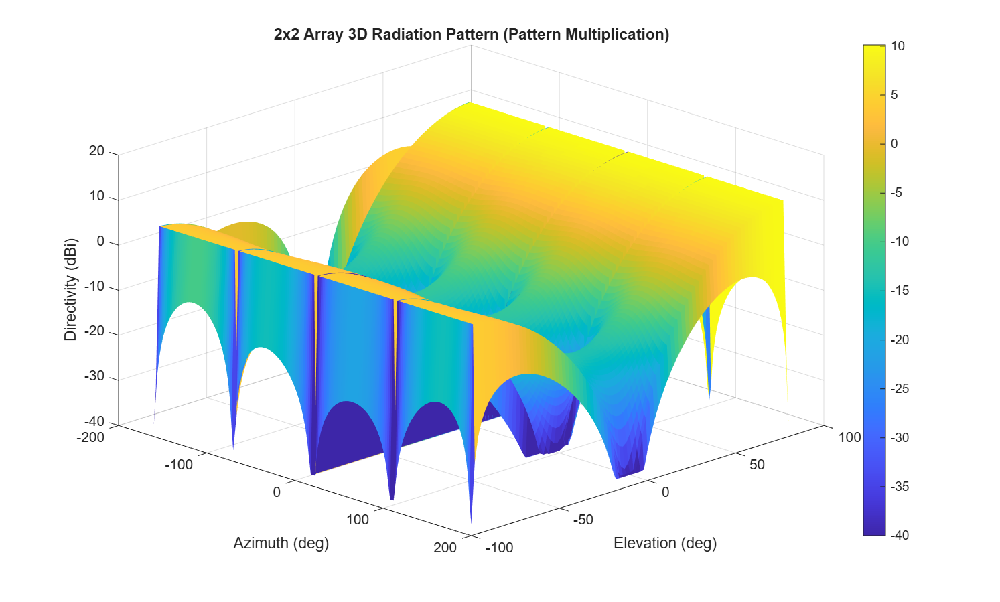

# 2.45 GHz Microstrip Patch Antenna Design & 2x2 Array Simulation

[](https://www.mathworks.com/products/matlab.html)
[](https://opensource.org/licenses/MIT)

A comprehensive MATLAB project for the analytical design, full-wave electromagnetic simulation, parameter optimization, and array synthesis of a 2.45 GHz Microstrip Patch Antenna. This antenna is optimized for Wi-Fi, Bluetooth, and ISM band applications using an FR-4 substrate.

## 📌 Features

- **Analytical Design:** Calculates theoretical patch dimensions based on the transmission line model.
- **Full-Wave Simulation:** Evaluates Impedance, S11, VSWR, and 3D Radiation Patterns using MATLAB's Antenna Toolbox.
- **Automated Optimization:** Employs the Optimization Toolbox (`fminsearch`) to fine-tune physical dimensions for perfect resonance at exactly 2.45 GHz.
- **Antenna Array Synthesis:** Constructs a 2x2 phased array and calculates the enhanced directivity and radiation pattern using the Pattern Multiplication principle (+6 dB Gain improvement).
- **Automated Reporting:** Generates a structured markdown technical report and exports all numerical data to CSV/MAT files.

## 🛠️ Requirements

- MATLAB R2021a or newer.
- **Antenna Toolbox** (Required for 3D modeling and EM simulation).
- **Optimization Toolbox** (Required for parameter tuning).
- **RF Toolbox** (Optional, used for Smith Chart generation).

## 📂 Project Structure

- `main.m`: The primary execution script that runs the single-element design, optimization, and report generation.
- `run_array_simulation.m`: A standalone script to build and simulate the 2x2 antenna array.
- `config.m`: Central configuration file for frequency, material, and optimization parameters.
- `build_*.m` / `calculate_*.m` / `simulate_*.m`: Modular functions for different stages of the design pipeline.
- `report/`: Contains the auto-generated `project_report.md`.
- `results/`: Contains generated PNG plots, CSV tables, and MAT data files.

## 🚀 How to Run

1. Clone the repository and navigate to the folder in the MATLAB command window.
2. **Run tests** to ensure the core mathematical functions and your MATLAB environment are set up correctly:
   ```matlab
   run_tests
   ```
3. **Run the single patch optimization and simulation:**
   ```matlab
   main
   ```
   *(Note: Full-wave EM simulations may take a few minutes depending on your CPU and mesh settings).*
4. **Run the 2x2 Antenna Array simulation:**
   ```matlab
   run_array_simulation
   ```

## 📊 Simulation Results

After running the full-wave electromagnetic simulation and parameter optimization, the single patch is perfectly tuned to 2.45 GHz, and the 2x2 array demonstrates a massive gain improvement.

### Reflection Coefficient (S11)


### Voltage Standing Wave Ratio (VSWR)


### 2x2 Array 3D Radiation Pattern
By arranging four of these optimized patches in a 2x2 planar array with a half-wavelength spacing, the maximum directivity increases from **~4.1 dBi** to **~10.1 dBi**, significantly enhancing the signal range and directivity.



## 📄 License
This project is licensed under the MIT License - see the [LICENSE](LICENSE) file for details.
