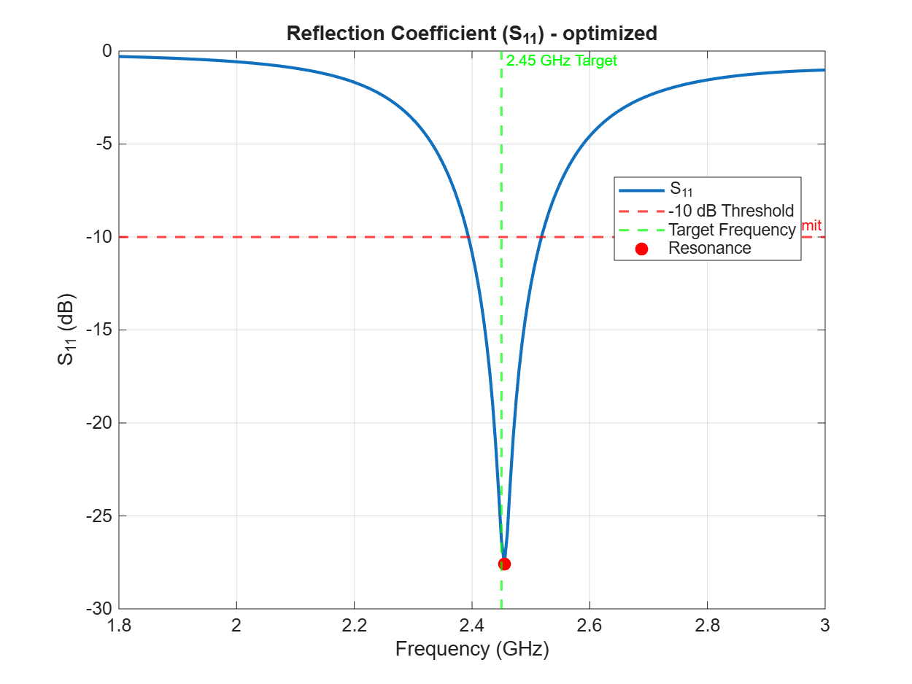
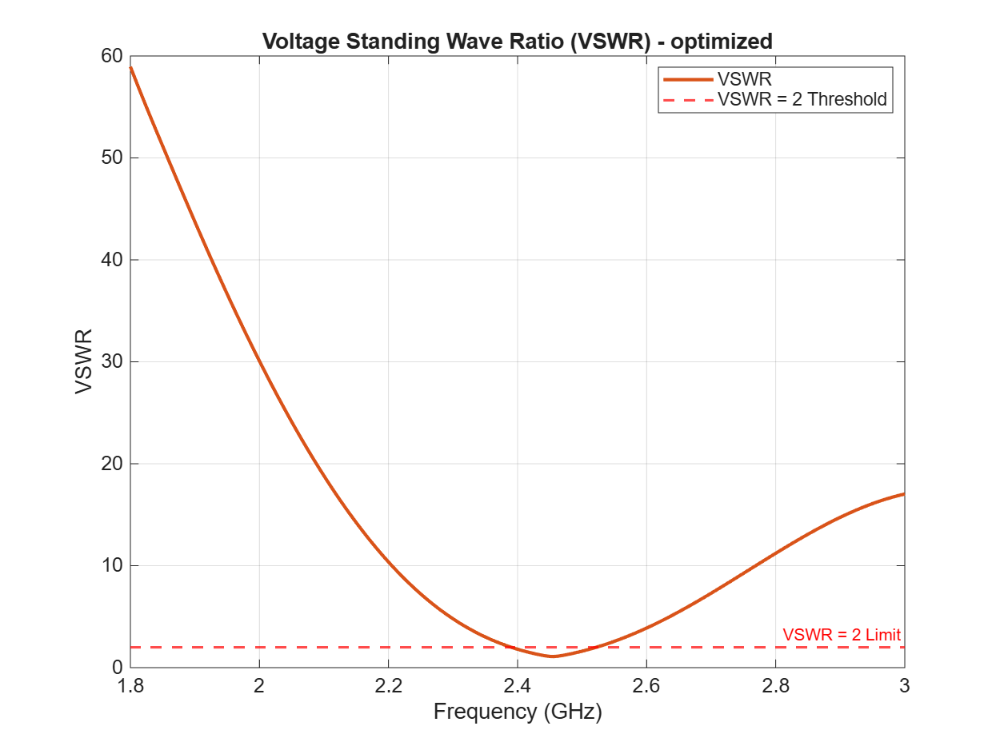

# 2.45 GHz Microstrip Patch Antenna Design

This project performs the analytical design, electromagnetic simulation, and optimization of a rectangular microstrip patch antenna with an FR-4 substrate operating at a 2.45 GHz center frequency using MATLAB.

## Requirements

* MATLAB R2021a or newer.
* **Antenna Toolbox:** Required for full-wave electromagnetic simulation.
* **Optimization Toolbox:** Required for fine-tuning dimensions to match the target resonance frequency.
* **RF Toolbox (Optional):** Required for Smith chart plots.

## Project Structure

* `main.m`: The main execution script. It automatically runs all calculations, simulations, and reporting processes.
* `config.m`: Contains parameters such as center frequency, substrate properties, and optimization weights.
* `calculate_patch_dimensions.m`: Calculates the analytical patch dimensions (W and L) based on the transmission line model.
* `simulate_patch_antenna.m`: Simulates antenna impedance, S11 parameter, VSWR, and radiation pattern.
* `optimize_patch_antenna.m`: Fine-tunes the antenna dimensions using `fminsearch`.
* `report/project_report.md`: The auto-generated technical summary report.
* `results/`: Contains generated PNG plots, CSV, and MAT result files.

## Simulation Results

After running the full-wave electromagnetic simulation and parameter optimization, the antenna is perfectly tuned to 2.45 GHz.

### Reflection Coefficient (S11)


### Voltage Standing Wave Ratio (VSWR)


## How to Run

1. Navigate to this directory (`antenna_design`) in the MATLAB command window.
2. First, run the tests to verify the accuracy of the core functions:
   ```matlab
   run_tests
   ```
3. Run the main script to start the project simulation and optimization:
   ```matlab
   main
   ```
   *Note: Full-wave electromagnetic simulations may take a few minutes depending on the mesh size.*
4. Once completed, check the `results/` folder for the generated plots and the `report/` folder for the technical report.
